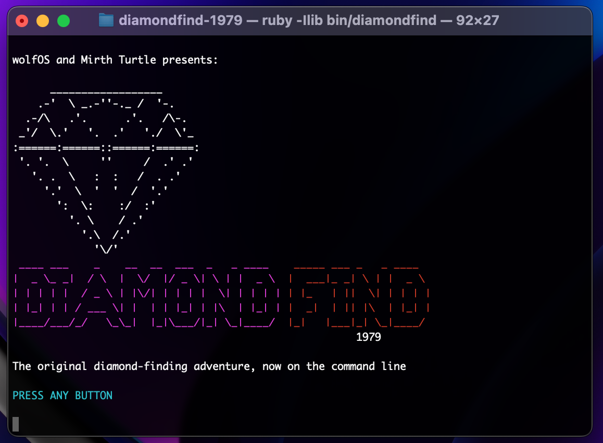

[Diamond Find](https://mirthturtle.com/diamondfind) client for your command line. Play the original or the mini-sequel, [Diamond Find: The Con Job](https://github.com/mirthturtle/diamondfind-conjob).

## Installation

Clone or download the repo.

Install dependencies: `gem install colorize httparty`

Run with: `ruby -Ilib bin/diamondfind`

## Controls

- Left: `z`
- Right: `x`
- Quit: `q`
- Reset: `r`
